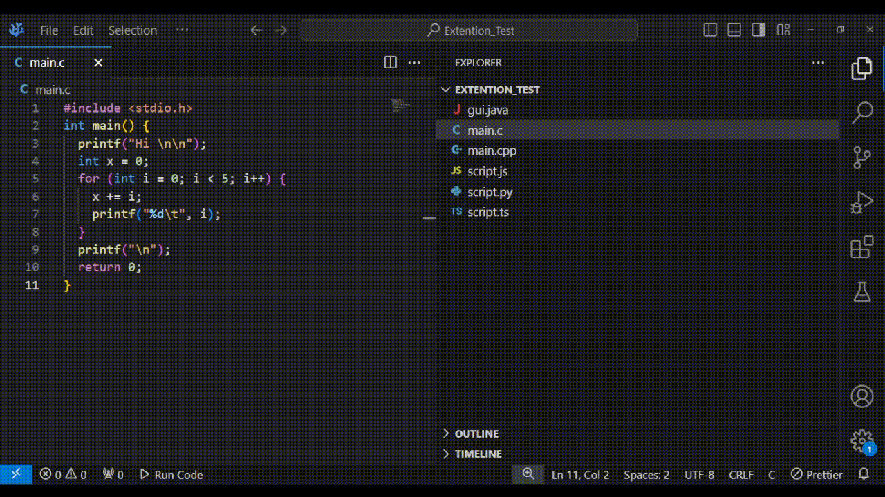

# Runner README

It simply runs code in termainal

you can customize commands as you like from settings.json

by default it runs c/cpp , py ,js and java

## usage

you need to activate it by `ctrl + shift + p` then type `Run Code`. The file openned will run in termainal. You can also click the status bar item named
`⯈ Run Code`.



## Example Configuration

To use custom commands, users can add them to `settings.json` like this:

```json
{
  //rest of your settings ...

  "runner.customCommands": [
    {
      "language": "c",
      "commandWindows": "gcc \"${filePath}\" -o \"${directoryPath}/${executableName}\" && \"${directoryPath}/${executableName}\"",
      "commandLinux": "gcc ${filePath} -o ${directoryPath}/${executableName} && ${directoryPath}/${executableName}"
    },
    {
      "language": "cpp",
      "commandWindows": "echo Runner on Windows!! && g++ \"${filePath}\" -o \"${directoryPath}/${executableName}\" && \"${directoryPath}/${executableName}\"",
      "commandLinux": "g++ ${filePath} -o ${directoryPath}/${executableName} && ${directoryPath}/${executableName}"
    },
    {
      "language": "py",
      "commandWindows": "python \"${filePath}\"",
      "commandLinux": "python3 ${filePath}"
    },
    {
      "language": "js",
      "commandWindows": "node \"${filePath}\"",
      "commandLinux": "node ${filePath}"
    },
    {
      "language": "ts",
      "commandWindows": "ts-node \"${filePath}\"",
      "commandLinux": "ts-node '${filePath}'"
    },
    {
      "language": "java",
      "commandWindows": "cd /d \"${directoryPath}\" && javac ${fileName} && java ${executableName}",
      "commandLinux": "cd ${directoryPath} && javac ${fileName} && java ${executableName}"
    },
    {
      "language": "pl",
      "commandWindows": "perl \"${filePath}\"",
      "commandLinux": "perl \"${filePath}\""
    },
    {
      "language": "m",
      "commandWindows": "octave '${filePath}'",
      "commandLinux": "octave '${filePath}'"
    },
    {
      "language": "sh",
      "commandLinux": "bash '${filePath}'"
    },
    {
      "language": "html",
      "commandWindows": "firefox '${filePath}'",
      "commandLinux": "firefox '${filePath}'"
    },
    {
      "language": "dart",
      "commandWindows": "dart run '${filePath}'",
      "commandLinux": "dart run '${filePath}'"
    }
  ]
}
```

### **Keywords of `settings.json`**

- `${filePath}` : full file name with its path, eg: `~/Documents/CodeFolder/app.c` 
- `${directoryPath}` : parent directory path, eg: `~/Documents/CodeFolder`
- `${fileName}` : file name only, eg: `app.c`
- `${executableName}` : file name only without the extention, eg: `app`


# Notes:

for windows :
 + Change command foe java to be `cd /d {Path}` instead of `cd {Path}` so it can change drives.
 + Make `default terminal` to be `command prompt` from VsCode settings
```json
{
  "language": "java",
  "command": "cd /d '${directoryPath}' && javac ${fileName} && java ${executableName}"
}
``` 
# What's new ? 
- OS detection and sepicifiying command for each system, whether Windows or Linux/MacOS

# Prebuilt VISX file 
[Runner V1.2.3](/runner-1.2.3.vsix)
